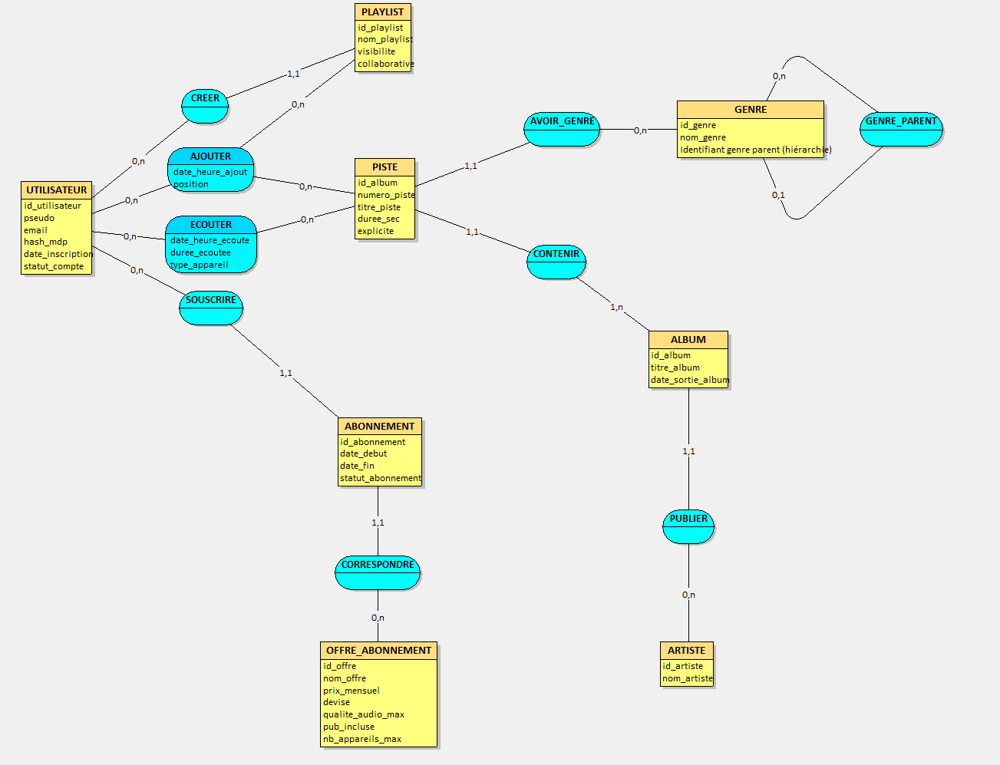

# ProjetDB_Boutrid_Li — Mini-projet MERISE (Streaming musical)

## Domaine
Plateforme de streaming musical (type Spotify/Deezer) avec :
- comptes utilisateurs
- offres et abonnements
- catalogue (artistes, albums, pistes, genres)
- playlists (personnelles / collaboratives)
- historique d’écoute

---

## Étape 1 — Analyse des besoins (prompt IA + résultats)

### Prompt IA utilisé

Tu travailles dans le domaine de du streaming musical en ligne. Ton entreprise a comme activité de proposer un service d’écoute de musique et de podcasts en streaming, avec gestion d’abonnements, de playlists, et d’espaces artistes pour publier des albums et des titres. C’est une entreprise (start-up) comme Spotify, Deezer ou Apple Music. Les données portent sur les comptes utilisateurs, les offres d’abonnement, les profils artistes, les albums et catalogues musicaux, les titres et leurs caractéristiques, les genres musicaux, les playlists et les historiques d’écoute. Inspire-toi des sites web et documentations techniques suivants : 

https://developer.spotify.com/documentation/web-api  (API Spotify), 
https://developers.deezer.com/api  (API Deezer) et 
https://musicbrainz.org/doc/MusicBrainz_Database/Schema  (schéma MusicBrainz).

Ton entreprise veut appliquer MERISE pour concevoir un système d'information. Tu es chargé de la partie analyse, c’est-à-dire de collecter les besoins auprès de l’entreprise. Elle a fait appel à un étudiant en ingénierie informatique pour réaliser ce projet, tu dois lui fournir les informations nécessaires pour qu’il applique ensuite lui-même les étapes suivantes de conception et développement de la base de données. 
D’abord, établis les règles de gestions des données de ton entreprise, sous la forme d'une liste à puce. Elle doit correspondre aux informations que fournit quelqu’un qui connaît le fonctionnement de l’entreprise, mais pas comment se construit un système d’information.
Ensuite, à partir de ces règles, fournis un dictionnaire de données brutes avec les colonnes suivantes, regroupées dans un tableau : signification de la donnée, type, taille en nombre de caractères ou de chiffres. Il doit y avoir entre 25 et 35 données. Il sert à fournir des informations supplémentaires sur chaque donnée (taille et type) mais sans a priori sur comment les données vont être modélisées ensuite.
Fournis donc les règles de gestion et le dictionnaire de données.

##

### Règles de gestion (métier)
- La plateforme gère des comptes utilisateurs identifiés par un email et un pseudo.
- Un utilisateur possède un statut de compte (actif / suspendu / désactivé).
- La plateforme propose des offres d’abonnement (nom, prix mensuel, devise, options).
- Un utilisateur peut souscrire plusieurs abonnements au cours du temps.
- Un abonnement est rattaché à une seule offre et possède une date de début, une date de fin (éventuelle) et un statut.
- La plateforme gère des artistes qui publient des albums.
- Un album contient des pistes ordonnées (numéro de piste).
- Chaque piste possède un titre, une durée et un indicateur explicite.
- Les pistes sont classées par genre ; un genre peut avoir un genre parent (hiérarchie).
- Un utilisateur peut créer des playlists.
- Une playlist a une visibilité (publique/privée) et peut être collaborative.
- Dans une playlist, on mémorise l’ajout d’une piste : qui a ajouté, quand, et la position dans la playlist.
- La plateforme enregistre l’historique d’écoute : utilisateur, piste écoutée, date/heure, durée écoutée et type d’appareil.

---

### Dictionnaire de données (35 données)
| Signification de la donnée | Type | Taille |
|---|---:|---:|
| Identifiant utilisateur | INT | 10 chiffres |
| Pseudo utilisateur | VARCHAR | 30 |
| Email utilisateur | VARCHAR | 254 |
| Identifiant offre d’abonnement | INT | 10 chiffres |
| Nom offre | VARCHAR | 40 |
| Prix mensuel | DECIMAL | 6,2 |
| Devise (EUR, USD…) | CHAR | 3 |
| Qualité audio max | VARCHAR | 10 |
| Publicité incluse (oui/non) | BOOLEAN | 1 |
| Nb appareils max simultanés | TINYINT | 2 |
| Identifiant abonnement | INT | 10 chiffres |
| Date début abonnement | DATE | 10 |
| Date fin abonnement | DATE | 10 |
| Statut abonnement (actif/expiré/résilié) | VARCHAR | 10 |
| Identifiant artiste | INT | 10 chiffres |
| Nom artiste | VARCHAR | 80 |
| Identifiant album | INT | 10 chiffres |
| Titre album | VARCHAR | 120 |
| Date sortie album | DATE | 10 |
| Identifiant genre | INT | 10 chiffres |
| Nom genre | VARCHAR | 40 |
| Identifiant genre parent (hiérarchie) | INT | 10 chiffres |
| Identifiant playlist | INT | 10 chiffres |
| Nom playlist | VARCHAR | 80 |
| Visibilité playlist (publique/privée) | VARCHAR | 12 |
| Playlist collaborative (oui/non) | BOOLEAN | 1 |
| Numéro de piste dans l’album | TINYINT | 2 |
| Titre de la piste | VARCHAR | 120 |
| Durée de la piste (secondes) | INT | 5 chiffres |
| Piste explicite (oui/non) | BOOLEAN | 1 |
| Date/heure ajout piste en playlist | DATETIME | 19 |
| Position de la piste dans la playlist | INT | 5 chiffres |
| Date/heure écoute | DATETIME | 19 |
| Durée écoutée (secondes) | INT | 5 chiffres |
| Type d’appareil (mobile/web/desktop…) | VARCHAR | 20 |

> Note : le MCD contient aussi certains attributs techniques supplémentaires (ex. hash_mdp, date_inscription, statut_compte) qui ne sont pas obligatoires dans la limite 25–35 du dictionnaire.

---

## Étape 2 — MCD

### Schéma MCD (Looping)

### Éléments avancés utilisés
- Entité faible : **PISTE** identifiée par (**id_album**, **numero_piste**) via l’association CONTENIR
- Association n-aire : **AJOUTER** (UTILISATEUR + PLAYLIST + PISTE) avec (date_heure_ajout, position)
- Association récursive : **GENRE_PARENT** (hiérarchie de genres)
