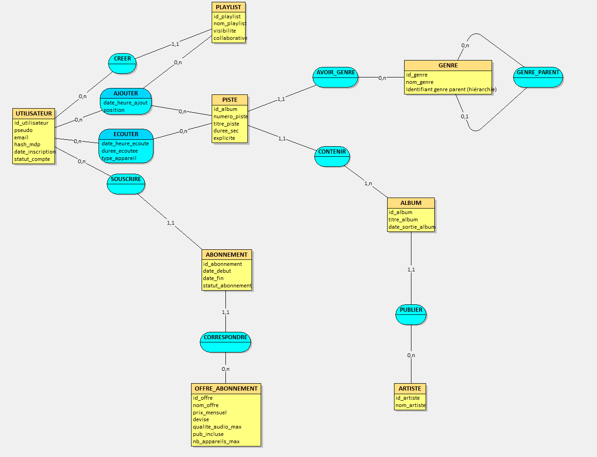
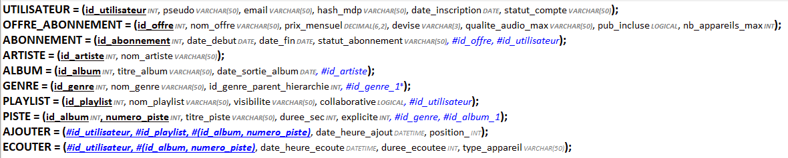

# ProjetDB_Boutrid_Li — Mini-projet MERISE (Streaming musical)

# PARTIE 1

## Domaine
Notre projet est une plateforme de streaming musical (type Spotify/Deezer/Apple Music) qui contient :
- comptes utilisateurs
- offres et abonnements
- catalogue (artistes, albums, pistes, genres)
- playlists (personnelles / collaboratives)
- historique d’écoute

---

## Étape 1 — Analyse des besoins (prompt IA + résultats)

### Prompt IA utilisé

Tu travailles dans le domaine de du streaming musical en ligne. Ton entreprise a comme activité de proposer un service d’écoute de musique et de podcasts en streaming, avec gestion d’abonnements, de playlists, et d’espaces artistes pour publier des albums et des titres. C’est une entreprise (start-up) comme Spotify, Deezer ou Apple Music. Les données portent sur les comptes utilisateurs, les offres d’abonnement, les profils artistes, les albums et catalogues musicaux, les titres et leurs caractéristiques, les genres musicaux, les playlists et les historiques d’écoute. Inspire-toi des sites web et documentations techniques suivants : 

https://developer.spotify.com/documentation/web-api  (API Spotify), 
https://developers.deezer.com/api  (API Deezer) et 
https://musicbrainz.org/doc/MusicBrainz_Database/Schema  (schéma MusicBrainz).

Ton entreprise veut appliquer MERISE pour concevoir un système d'information. Tu es chargé de la partie analyse, c’est-à-dire de collecter les besoins auprès de l’entreprise. Elle a fait appel à un étudiant en ingénierie informatique pour réaliser ce projet, tu dois lui fournir les informations nécessaires pour qu’il applique ensuite lui-même les étapes suivantes de conception et développement de la base de données. 
D’abord, établis les règles de gestions des données de ton entreprise, sous la forme d'une liste à puce. Elle doit correspondre aux informations que fournit quelqu’un qui connaît le fonctionnement de l’entreprise, mais pas comment se construit un système d’information.
Ensuite, à partir de ces règles, fournis un dictionnaire de données brutes avec les colonnes suivantes, regroupées dans un tableau : signification de la donnée, type, taille en nombre de caractères ou de chiffres. Il doit y avoir entre 25 et 35 données. Il sert à fournir des informations supplémentaires sur chaque donnée (taille et type) mais sans a priori sur comment les données vont être modélisées ensuite.
Fournis donc les règles de gestion et le dictionnaire de données.

##

### Règles de gestion (métier)
- La plateforme gère des comptes utilisateurs, identifiés par une adresse email et un pseudonyme.

- Chaque utilisateur possède un statut de compte (actif, suspendu ou désactivé).

- La plateforme propose différentes offres d’abonnement, caractérisées par un nom, un prix mensuel, une devise et des options.

- Un utilisateur peut souscrire à plusieurs abonnements au fil du temps.

- Chaque abonnement est associé à une seule offre et comporte une date de début, une date de fin éventuelle ainsi qu’un statut.

- La plateforme gère également des artistes qui publient des albums.

- Un album est composé de plusieurs pistes, organisées selon un numéro d’ordre.

- Chaque piste possède un titre, une durée et un indicateur de contenu explicite.

- Les pistes sont classées par genre musical ; un genre peut être rattaché à un genre parent, formant ainsi une hiérarchie.

- Les utilisateurs ont la possibilité de créer des playlists.

- Une playlist possède un niveau de visibilité (publique ou privée) et peut être collaborative.

- Pour chaque piste ajoutée dans une playlist, la plateforme enregistre l’utilisateur qui l’a ajoutée, la date d’ajout et sa position dans la playlist.

- Enfin, la plateforme conserve un historique d’écoute, comprenant l’utilisateur, la piste écoutée, la date et l’heure de l’écoute, la durée d’écoute et le type d’appareil utilisé.

---

### Dictionnaire de données (35 données)
| Signification de la donnée | Type | Taille |
|---|---:|---:|
| Identifiant utilisateur | INT | 10 chiffres |
| Pseudo utilisateur | VARCHAR | 50 |
| Email utilisateur | VARCHAR | 50 |
| Identifiant offre d’abonnement | INT | 10 chiffres |
| Nom offre | VARCHAR | 50 |
| Prix mensuel | DECIMAL | 6,2 |
| Devise (EUR, USD…) | VARCHAR | 3 |
| Qualité audio max | VARCHAR | 50 |
| Publicité incluse (oui/non) | BOOLEAN | 1 |
| Nb appareils max simultanés | INT | 10 |
| Identifiant abonnement | INT | 10 chiffres |
| Date début abonnement | DATE | 10 |
| Date fin abonnement | DATE | 10 |
| Statut abonnement (actif/expiré/résilié) | VARCHAR | 50 |
| Identifiant artiste | INT | 10 chiffres |
| Nom artiste | VARCHAR | 50 |
| Identifiant album | INT | 10 chiffres |
| Titre album | VARCHAR | 50 |
| Date sortie album | DATE | 10 |
| Identifiant genre | INT | 10 chiffres |
| Nom genre | VARCHAR | 50 |
| Identifiant genre parent (hiérarchie) | INT | 10 chiffres |
| Identifiant playlist | INT | 10 chiffres |
| Nom playlist | VARCHAR | 50 |
| Visibilité playlist (publique/privée) | VARCHAR | 50 |
| Playlist collaborative (oui/non) | BOOLEAN | 1 |
| Numéro de piste dans l’album | INT | 10 |
| Titre de la piste | VARCHAR | 50 |
| Durée de la piste (secondes) | INT | 10 chiffres |
| Piste explicite (oui/non) | BOOLEAN | 1 |
| Date/heure ajout piste en playlist | DATETIME | 19 |
| Position de la piste dans la playlist | INT | 5 chiffres |
| Date/heure écoute | DATETIME | 19 |
| Durée écoutée (secondes) | INT | 5 chiffres |
| Type d’appareil (mobile/web/desktop…) | VARCHAR | 50 |

> Remarque : le MCD inclut également certains attributs techniques supplémentaires (par exemple hash_mdp, date_inscription ou statut_compte). Ceux-ci ne sont toutefois pas obligatoires dans la limite de 25 à 35 éléments du dictionnaire.

---

## Étape 2 — MCD

### Schéma MCD (Looping)

### Éléments avancés utilisés
- Entité faible : **PISTE** identifiée par (**id_album**, **numero_piste**) via l’association CONTENIR
- Association n-aire : **AJOUTER** (UTILISATEUR + PLAYLIST + PISTE) avec (date_heure_ajout, position)
- Association récursive : **GENRE_PARENT** (hiérarchie de genres)

# PARTIE 2
## MLD :

UTILISATEUR = (id_utilisateur INT, pseudo VARCHAR(50), email VARCHAR(50), hash_mdp VARCHAR(50), date_inscription DATE, statut_compte VARCHAR(50));

OFFRE_ABONNEMENT = (id_offre INT, nom_offre VARCHAR(50), prix_mensuel DECIMAL(6,2), devise VARCHAR(3), qualite_audio_max VARCHAR(50), pub_incluse LOGICAL, nb_appareils_max INT);

ABONNEMENT = (id_abonnement INT, date_debut DATE, date_fin DATE, statut_abonnement VARCHAR(50), #id_offre, #id_utilisateur);

ARTISTE = (id_artiste INT, nom_artiste VARCHAR(50));

ALBUM = (id_album INT, titre_album VARCHAR(50), date_sortie_album DATE, #id_artiste);

GENRE = (id_genre INT, nom_genre VARCHAR(50), id_genre_parent_hierarchie INT, #id_genre_parent);

PLAYLIST = (id_playlist INT, nom_playlist VARCHAR(50), visibilite VARCHAR(50), collaborative LOGICAL, #id_utilisateur);

PISTE = (id_album INT, numero_piste INT, titre_piste VARCHAR(50), duree_sec INT, explicite INT, #id_genre, #id_album_1);

AJOUTER = (#id_utilisateur, #id_playlist, #(id_album, numero_piste), date_heure_ajout DATETIME, position_ INT);

ECOUTER = (#id_utilisateur, #(id_album, numero_piste), date_heure_ecoute DATETIME, duree_ecoutee INT, type_appareil VARCHAR(50));

---

## Scénario d'utilisation
**Rôle :** Responsable Marketing de la plateforme de streaming.
**Objectif :** Analyser les tendances d'écoute pour optimiser les abonnements et proposer des contenus adaptés.
**Données à extraire :** - Liste des utilisateurs premium actifs.
- Statistiques des artistes les plus populaires.
- Analyse des playlists collaboratives les plus remplies.
- Historique d'écoute par type d'appareil.
